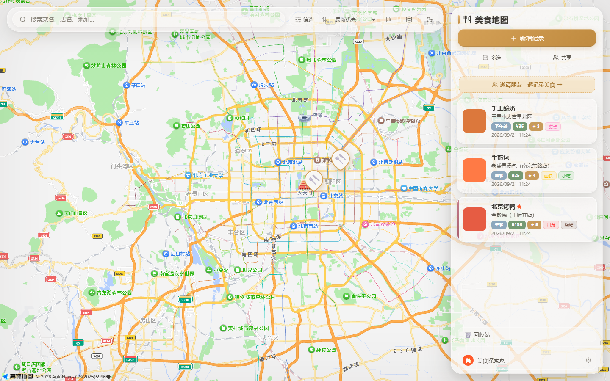
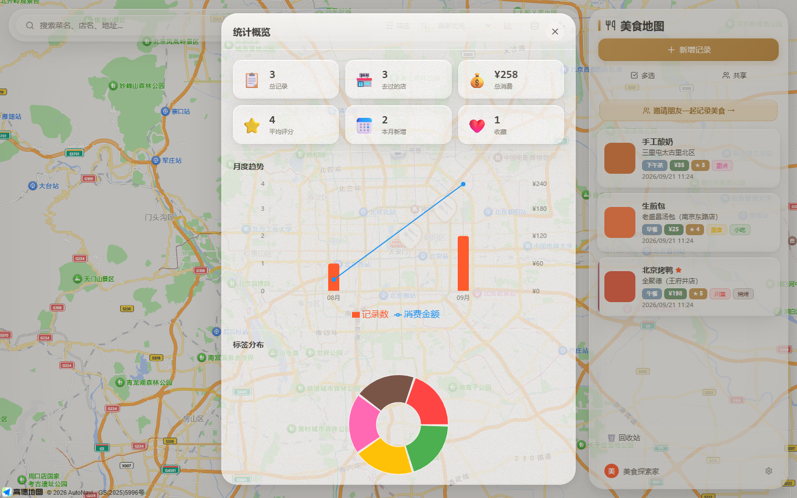

# Food Map 美食地图

<p align="center">
  <strong>在地图上收藏每一顿值得记住的味道。</strong><br>
  一个支持图片、评分、标签、统计与房间共享的自托管美食记录应用。
</p>

<p align="center">
  <a href="https://github.com/1Lyn-en/food-map/actions/workflows/ci.yml"></a>
  <a href="https://github.com/1Lyn-en/food-map/releases/tag/v0.9.0"></a>
  
  <a href="LICENSE"></a>
  
</p>

> **当前版本：v0.9.0 Beta。** 已具备完整的本地使用体验，适合作品展示、个人自托管和可信小范围共享。身份仍基于浏览器本地 UUID，不建议直接暴露到不可信公网。



<details>
<summary><strong>查看统计概览</strong></summary>



</details>

## 为什么做这个项目

地图收藏通常只记地点，相册通常只留照片。Food Map 把餐厅位置、菜品照片、评分、消费、标签和同行者放在同一条记录里，让“去哪里吃过、吃了什么、值不值得再去”可以搜索、筛选和回顾。

## 核心能力

- **地图化记录**：高德地图搜索、选点、逆地理编码和 Marker 展示
- **完整用餐档案**：菜名、餐厅、图片、评分、人均、标签、用餐类型、日期与备注
- **快速整理**：关键词、时间、评分、价格、标签、收藏和图片筛选
- **数据洞察**：记录数、店铺数、消费、评分、月度趋势与标签分布
- **可信共享**：本地身份、房间码、成员列表和分组可见性
- **数据可带走**：JSON 全量导出/恢复、CSV 导出、WAL 一致性 SQLite 快照
- **安全数据操作**：非破坏性演示数据初始化、失败回滚、共享文件引用保护
- **多端体验**：响应式布局、亮/暗主题、PWA 与基础离线应用壳

## 快速开始

### 环境要求

- Node.js 22.16+（推荐 Node.js 24 LTS）
- npm 10+
- 高德地图 Web JS API Key（地图功能需要）

### 1. 获取项目并安装依赖

```bash
git clone https://github.com/1Lyn-en/food-map.git
cd food-map
npm run install:all
```

### 2. 配置地图

Windows PowerShell：

```powershell
Copy-Item frontend/.env.example frontend/.env
```

macOS / Linux：

```bash
cp frontend/.env.example frontend/.env
```

编辑 `frontend/.env`：

```dotenv
VITE_AMAP_KEY=your_amap_web_js_api_key
VITE_AMAP_SECURITY_CODE=your_amap_security_code
```

真实密钥不会被 Git 跟踪。未配置 Key 时，侧栏、记录、统计和数据管理仍可使用，地图与选点不可用。

### 3. 启动开发环境

```bash
npm run dev
```

访问 <http://localhost:5173>。

### 4. 可选：初始化演示数据

```bash
npm run seed
```

`seed` **只初始化空数据库**。检测到任何记录、图片、标签、用户、房间或设置时会停止，不会覆盖或清空已有数据。需要隔离体验时，请为 `DB_PATH` 和 `UPLOADS_DIR` 指定新的目录。

## 验证与质量门禁

```bash
# 后端集成与数据可靠性测试
npm test

# 前端生产构建
npm run build

# 首次运行 E2E 前安装 Chromium
npm run e2e:install

# Playwright 端到端测试
npm run test:e2e

# 完整门禁
npm run verify
```

当前验证基线：

- 后端：**55/55**（含 11 项数据可靠性回归）
- Playwright Chromium：**8/8**
- 生产构建：通过
- 根、前端、后端依赖审计：0 个已知漏洞

展示截图也可从隔离数据重复生成：

```bash
npm run showcase:capture
```

该命令使用临时 SQLite 与上传目录，不读取或修改默认业务数据。

## 数据可靠性

### JSON 备份与恢复

- `v1.1` 完整备份包含记录、图片字节、标签关系、设置、用户、房间和成员
- 恢复图片时使用新随机路径，不按备份路径覆盖本地文件
- 同 ID 记录跳过，不覆盖本地记录、图片和标签关系
- 非法路径、损坏图片和断裂引用会拒绝导入并回滚
- `v1.0` 旧备份缺少图片或身份元数据时安全降级并返回 warning

### SQLite 快照与永久删除

- SQLite 下载使用在线备份 API，包含 WAL 中尚未 checkpoint 的已提交数据
- 活动写事务期间导出和快照返回 `409`，不产生半完成备份
- 永久删除先隔离文件再提交数据库事务，失败时恢复文件
- 仍被其他记录引用的共享图片不会误删

## 生产运行

```bash
npm run build
npm start
```

后端默认监听 <http://localhost:3001>，并在 `frontend/dist` 存在时托管前端页面。

生产部署前至少需要：

1. 将正式域名加入高德 Key 的域名白名单，并重新构建前端。
2. 使用 HTTPS；浏览器定位功能在非 localhost 环境需要安全上下文。
3. 持久化挂载 `backend/data`、`backend/uploads` 与 `backend/backups`。
4. 设置 `CORS_ORIGINS`，或保持前后端同源。
5. 在反向代理层增加访问控制、请求限流和上传配额。
6. 制定自动备份、保留和定期恢复演练策略。

> 当前没有公共在线演示。项目使用本地 SQLite 和文件存储，且尚未接入生产级认证；仓库截图由真实应用在隔离演示数据上生成。

## 环境变量

| 变量 | 作用 | 默认值 |
| --- | --- | --- |
| `VITE_AMAP_KEY` | 高德 Web JS API Key | 空 |
| `VITE_AMAP_SECURITY_CODE` | 高德安全密钥 | 空 |
| `PORT` | 后端监听端口 | `3001` |
| `DB_PATH` | SQLite 数据库路径 | `backend/data/food-map.db` |
| `UPLOADS_DIR` | 上传文件目录 | `backend/uploads` |
| `BACKUPS_DIR` | 备份目录 | `backend/backups` |
| `FRONTEND_DIST` | 前端构建产物目录 | `frontend/dist` |
| `CORS_ORIGINS` | 允许的跨域来源，逗号分隔 | `http://localhost:5173` |

## 技术栈

- **前端**：React 18、Vite 8、Recharts、Lucide React、Playwright
- **后端**：Express 4、Node.js `node:sqlite`、Zod、Multer、Sharp
- **数据**：SQLite + 本地图片存储
- **工程**：GitHub Actions、npm workspaces-style 根脚本、PWA

## 项目结构

```text
food-map/
├─ .github/workflows/       # GitHub Actions
├─ docs/
│  ├─ images/               # README 真实界面截图
│  └─ *.md                  # PRD、路线、设计与验证资料
├─ backend/
│  ├─ scripts/              # 维护脚本
│  ├─ src/                  # API、数据库、备份与校验
│  └─ test/                 # Node 集成与可靠性测试
├─ frontend/
│  ├─ e2e/                  # Playwright 端到端测试
│  ├─ scripts/              # 可复现展示素材脚本
│  ├─ public/               # PWA 静态资源
│  └─ src/                  # React 应用
├─ CONTRIBUTING.md
├─ SECURITY.md
└─ package.json             # 根级开发、构建与验证入口
```

运行时数据库、上传文件、备份、构建产物与测试报告不会提交到 Git。

## API 摘要

- `/api/entries`：记录 CRUD、筛选、分页、回收站与统计
- `/api/tags`：标签 CRUD
- `/api/users`：本地用户资料
- `/api/groups`：共享房间与成员
- `/api/export`、`/api/import`：JSON 完整备份与合并恢复
- `/api/export/csv`：表格数据导出
- `/api/backup/download`：WAL 一致性 SQLite 快照
- `/api/health`：健康检查

## 文档与参与

- [项目完成度与发布边界](docs/project-status.md)
- [版本变更记录](CHANGELOG.md)
- [产品需求](docs/product-requirements.md)
- [实现路线](docs/roadmap.md)
- [UI 设计方案](docs/ui-design.md)
- [历史验收记录](docs/verification.md)
- [贡献指南](CONTRIBUTING.md)
- [安全说明](SECURITY.md)

欢迎通过 [Issue](https://github.com/1Lyn-en/food-map/issues) 反馈问题，或阅读 [CONTRIBUTING.md](CONTRIBUTING.md) 后提交 Pull Request。

## License

本项目采用 [MIT License](LICENSE)。
